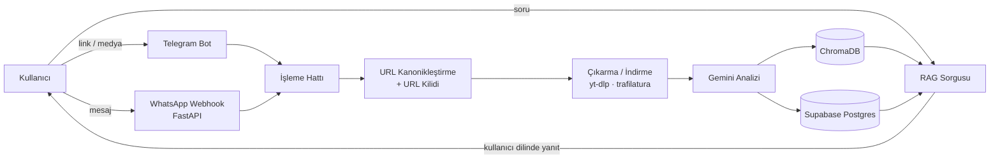

# Second Brain Bot

Telegram (ve WhatsApp) üzerinden gönderilen linkleri ve medyayı analiz edip aranabilir bir kişisel bilgi tabanına dönüştüren bir bot.

Instagram, YouTube, TikTok, LinkedIn, Twitter/X ve genel web sayfalarından gelen içerikleri indirir, Gemini ile analiz eder, vektör olarak indeksler ve kullanıcının sorularını kendi kaydettiği içerikler üzerinden (RAG), kullanıcının tercih ettiği dilde yanıtlar. Amaç, sosyal medyada "sonra bakarım" diye kaydedilen ve sonra bulunamayan içeriği geri getirilebilir hale getirmektir.

## Özellikler

- **Çoklu kaynak:** Instagram (reel, post, carousel), YouTube, TikTok, LinkedIn, Twitter/X ve genel web makaleleri
- **Doğrudan medya yükleme:** fotoğraf, video ve sesli mesaj
- **Multimodal analiz:** Gemini file upload API ile görsel/video/ses içeriğinden özet ve anahtar noktalar çıkarma
- **RAG tabanlı sohbet:** Kaydedilmiş içerikler üzerinden anlamsal arama ve sohbet biçiminde yanıt
- **Çok dilli sunum:** Analiz içeriğin kaynak dilinde yapılır, kullanıcının diline gerektiğinde çevrilir ve önbelleğe alınır
- **Mükerrer işlem koruması:** URL kanonikleştirme ve süreç içi kilitle aynı içeriğin iki kez indirilmesi/analiz edilmesi engellenir
- **Çoklu kanal:** Telegram (polling) ve WhatsApp (webhook) aynı işleme hattını kullanır

## Mimari



Tek süreçte çalışır: `python-telegram-bot` polling'i ve FastAPI sunucusu (sağlık kontrolü + WhatsApp webhook) aynı asyncio event loop'unda başlatılır.

Proje yapısı:

```
app.py                  # Bot handler'ları, webhook, çıkarma hattı, Gemini ve RAG akışı
app/db/                 # Supabase istemcisi, repository'ler, URL kanonikleştirme
app/db/repositories/    # users, channels, contents, user_contents, jobs
app/services/           # Medya yardımcıları (ör. içerik tipi tespiti)
tests/                  # Birim testleri
```

### Veri modeli

- `contents`: Kullanıcıdan bağımsız, `canonical_url` ile tekil içerik varlığı
- `content_analyses`: İçeriğe ait kanonik analiz (kaynak dilinde)
- `content_translations`: Kullanıcı diline çeviri önbelleği
- `user_contents`: Kullanıcı ile içerik arasındaki ilişki (kaydetme, yıldız, görüntülenme)
- `users` / `channels`: Kimlik ve erişim kanalı ayrı tutulur; Telegram veya WhatsApp hesabı kullanıcı kimliği değil, bir kanaldır
- `processing_jobs`: İşleme denemeleri ve hata kayıtları

Tüm tablolarda Row Level Security açıktır; backend sunucu tarafında service-role anahtarıyla çalışır.

## Teknolojiler ve seçim nedenleri

| Teknoloji | Neden |
|---|---|
| Python 3.11+ / asyncio | Bot, webhook ve I/O ağırlıklı indirme işleri için uygun; yt-dlp ve Gemini SDK ekosistemi Python'da |
| python-telegram-bot v20+ | Async API'si ile FastAPI ile aynı event loop'ta çalışabiliyor |
| FastAPI + uvicorn | Hafif sağlık kontrolü ve WhatsApp webhook uç noktası |
| Google Gemini (`google-genai`) | Video, görsel ve sesi tek API'de analiz edebilen multimodal model; ayrı transkripsiyon/görsel modeli gerektirmiyor |
| Supabase Postgres | Yönetilen Postgres, RLS ve pgvector desteği, ileride web/mobil auth'a geçiş imkânı |
| ChromaDB | Yerel, kurulumsuz vektör deposu; hızlı prototipleme için |
| yt-dlp, trafilatura | Video platformları için indirme, web sayfaları için ana metin çıkarma |
| Docker | ffmpeg dahil tekrarlanabilir çalışma ortamı |

## Öne çıkan teknik kararlar ve zorluklar

**Kanonik içerik ve sunum dili ayrımı.** Analiz kullanıcıya değil içeriğe aittir. Aynı içerik farklı kullanıcılar tarafından kaydedildiğinde Gemini yalnızca bir kez çağrılır. Kullanıcının dili kaynak dilden farklıysa çeviri talep üzerine üretilir ve `content_translations` tablosunda saklanır.

**URL kanonikleştirme.** Aynı içerik birçok biçimde gelebilir (`youtu.be/ID`, `/shorts/ID`, `?igsh=` ve `utm_*` parametreleri vb.). Tek bir `normalize_url` fonksiyonu hem veritabanı benzersizlik kısıtı hem de Chroma doküman kimliği (`doc_{user_id}_{sha256(url)[:24]}`) için kullanılır. Böylece tekrar gönderimler aynı kayda çözülür ve vektör indeksinde kopya oluşmaz.

**İçerik yaşam döngüsü.** Her içerik `received → extracting → processing → embedding → completed` (veya `failed`) durumlarından geçer. `canonical_url` üzerindeki UNIQUE kısıtı nedeniyle başarısız bir kayıt tekrar denendiğinde yeni satır eklenmez, mevcut satır yeniden işlenir; yarım kalmış işlemler aynı `content_id` ile devam ettirilir.

**Eşzamanlılık.** Aynı URL'ye aynı anda gelen istekler referans sayaçlı, süreç içi bir kilitle sıraya alınır; farklı URL'ler paralel çalışır. Kilit, bekleyen kalmadığında sözlükten silinir.

**Boş girdiyle analiz riski.** İndirme sessizce başarısız olduğunda (medya ve açıklama boş) Gemini'ye boş girdiyle istek gitmesi, makul görünen ama alakasız bir analiz üretilmesine yol açtı. Bu durum gerçek bir kullanıcı raporuyla ortaya çıktı; şimdi hem medya hem metin boşsa analiz engelleniyor ve test ile kapsanıyor.

**RAG ve vektör depolama.** Vektörler yerel ChromaDB'de tutuluyor. Kalıcı disk olmayan ortamlarda (ör. ücretsiz PaaS katmanları) bu indeks her deploy'da sıfırlanır; kanonik analizler Supabase'de kaldığı için veri kaybolmaz, ancak indeksin yeniden kurulması gerekir. Bu bilinen bir sınırlamadır. Değerlendirilen yönler: başlangıçta indeksi Supabase'deki analizlerden yeniden inşa etmek veya zaten etkin olan pgvector'e geçip ayrı vektör servisini kaldırmak.

**Platform kısıtları.** YouTube'un bot tespiti ve Cloudflare korumalı siteler bazı içeriklerin alınmasını engelleyebilir. Bunları proxy veya headless tarayıcıyla aşmaya çalışmak yerine YouTube desteği "best-effort" olarak bırakıldı; kullanıcıya net bir hata döndürülüyor. Bu, kullanım koşullarına uyum ve sürdürülebilirlik açısından bilinçli bir tercihtir.

**Windows geliştirme ortamı.** Geliştirme Windows'ta yapıldığı için `api.telegram.org` bağlantılarında görülen `WinError 10054` hatası IPv4 zorlanarak, event loop ise `WindowsSelectorEventLoopPolicy` ile çözüldü.

## Kurulum

### Gereksinimler

- Python 3.11+
- ffmpeg (Docker imajında hazır gelir)
- Bir Telegram bot token'ı, Gemini API anahtarı ve Supabase projesi
- Dışa istek için proxy hizmeti kullanılıyorsa kullanıcı adı/parolası

### Ortam değişkenleri

Proje kökünde `.env` dosyası oluşturun (bu dosya sürüm kontrolüne eklenmemelidir):

```
TELEGRAM_BOT_TOKEN=
GEMINI_API_KEY=
SUPABASE_URL=
SUPABASE_SECRET_KEY=
PROXY_USER=
PROXY_PASS=
# WhatsApp kanalı için ek WHATSAPP_* değişkenleri gerekir
```

`SUPABASE_SECRET_KEY` service-role anahtarıdır; yalnızca sunucuda tutulmalı, istemciye verilmemelidir.

### Yerel çalıştırma

```bash
git clone <repo-url>
cd insta_bot
python -m venv .venv
source .venv/bin/activate        # Windows: .venv\Scripts\activate
pip install -r requirements.txt
python app.py
```

Bot Telegram polling ile başlar; FastAPI sunucusu `PORT` değişkeninde (varsayılan 8000) çalışır.

### Docker

```bash
docker build -t insta-bot .
docker run --env-file .env -p 8000:8000 insta-bot
```

Chroma verisinin container yeniden başlatıldığında korunması için `/app/chroma_data` dizinine bir volume bağlayın:

```bash
docker run --env-file .env -p 8000:8000 -v chroma_data:/app/chroma_data insta-bot
```

`Procfile` aynı komutu (`python app.py`) worker süreci olarak çalıştırır; PaaS dağıtımları için kullanılabilir.

### Testler

```bash
python -m unittest discover tests
```

Bazı testler Supabase'e bağlanır; test için ayrı bir Supabase projesi ve `.env.test` kullanılması önerilir.
