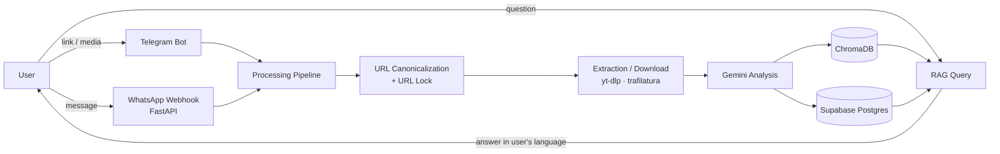

# Second Brain Bot

A Telegram bot that turns saved links and media into a searchable personal knowledge base. The codebase and data model also support a WhatsApp channel, currently unused in production.

It downloads content from Instagram, YouTube, TikTok, LinkedIn, Twitter/X, and general web pages, analyzes it with Gemini, indexes it as vectors, and answers the user's questions based on their own saved content (RAG), in the user's preferred language. The goal is to make content saved with an "I'll check this later" intent — and then never found again — actually retrievable.

## Features

- **Multi-source support:** Instagram (reels, posts, carousels), YouTube, TikTok, LinkedIn, Twitter/X, and general web articles
- **Direct media upload:** photos, videos, and voice messages
- **Multimodal analysis:** summaries and key points extracted from image/video/audio content via the Gemini file upload API
- **RAG-based chat:** semantic search and conversational answers over saved content
- **Multilingual output:** analysis is done in the content's source language, then translated into the user's language on demand and cached
- **Duplicate-processing protection:** URL canonicalization plus an in-process lock prevent the same content from being downloaded or analyzed twice
- **Multi-channel by design:** Telegram (polling) is the active channel; a WhatsApp webhook uses the same processing pipeline but is not currently enabled in production

## Architecture



The diagram above shows the full multi-channel design. In the current deployment, only the Telegram channel is live; the WhatsApp webhook exists in code and shares the same pipeline but is not wired to an active number.

Runs as a single process: `python-telegram-bot` polling and a FastAPI server (health check + WhatsApp webhook) are started in the same asyncio event loop.

Project structure:

```
app.py                  # Bot handlers, webhook, extraction pipeline, Gemini and RAG flow
app/db/                 # Supabase client, repositories, URL canonicalization
app/db/repositories/    # users, channels, contents, user_contents, jobs
app/services/           # Media helpers (e.g. content type detection)
tests/                  # Unit tests
```

### Data model

- `contents`: user-independent, unique content entity keyed by `canonical_url`
- `content_analyses`: canonical analysis of the content (in its source language)
- `content_translations`: cache of translations into the user's language
- `user_contents`: relationship between a user and a content item (saved, starred, viewed)
- `users` / `channels`: identity and access channel are kept separate; a Telegram or WhatsApp account is not a user identity, it's a channel
- `processing_jobs`: processing attempts and error records

Row Level Security is enabled on all tables; the backend runs server-side with a service-role key.

## Tech stack and rationale

| Technology | Why |
|---|---|
| Python 3.11+ / asyncio | Fits the bot, webhook, and I/O-heavy download workload; yt-dlp and the Gemini SDK ecosystem are Python-first |
| python-telegram-bot v20+ | Async API lets it run in the same event loop as FastAPI |
| FastAPI + uvicorn | Lightweight health check and WhatsApp webhook endpoint |
| Google Gemini (`google-genai`) | Multimodal model that analyzes video, image, and audio through a single API, avoiding separate transcription/vision models |
| Supabase Postgres | Managed Postgres with RLS and pgvector support, with room to move to web/mobile auth later |
| ChromaDB | Local, zero-setup vector store for fast prototyping |
| yt-dlp, trafilatura | Downloading from video platforms, main-text extraction from web pages |
| Docker | Reproducible runtime environment, including ffmpeg |

## Key technical decisions and challenges

**Separating canonical content from presentation language.** Analysis belongs to the content, not the user. When the same content is saved by different users, Gemini is only called once. If a user's language differs from the source language, a translation is generated on demand and cached in `content_translations`.

**URL canonicalization.** The same content can arrive in many forms (`youtu.be/ID`, `/shorts/ID`, `?igsh=` and `utm_*` params, etc.). A single `normalize_url` function is used both for the database uniqueness constraint and for the Chroma document ID (`doc_{user_id}_{sha256(url)[:24]}`). This resolves repeated submissions to the same record and prevents duplicates in the vector index.

**Content lifecycle.** Each content item moves through `received → extracting → processing → embedding → completed` (or `failed`). Because of the UNIQUE constraint on `canonical_url`, retrying a failed item doesn't create a new row — it reprocesses the existing one, and partially completed work resumes under the same `content_id`.

**Concurrency.** Requests for the same URL arriving at the same time are queued behind a reference-counted, in-process lock; different URLs run in parallel. The lock is removed from the dictionary once nothing is waiting on it.

**Risk of analyzing empty input.** When a download silently failed (both media and caption empty), sending an empty request to Gemini produced a plausible-looking but irrelevant analysis. This surfaced through a real user report; analysis is now blocked whenever both media and text are empty, and it's covered by a test.

**RAG and vector storage.** Vectors are kept in a local ChromaDB instance. On environments without persistent disk (e.g. free PaaS tiers), this index resets on every deploy; since canonical analyses live in Supabase, no data is lost, but the index has to be rebuilt. This is a known limitation. Options considered: rebuilding the index from Supabase analyses on startup, or moving to the already-available pgvector and dropping the separate vector service.

**Platform constraints.** YouTube's bot detection and Cloudflare-protected sites can block some content from being fetched. Rather than working around these with a proxy or a headless browser, YouTube support is treated as best-effort, and the user gets a clear error instead. This is a deliberate choice for maintainability and to stay within each platform's terms of use.

**Windows development environment.** Since development happened on Windows, a `WinError 10054` seen on `api.telegram.org` connections was fixed by forcing IPv4, and the event loop was set to `WindowsSelectorEventLoopPolicy`.

## Setup

### Requirements

- Python 3.11+
- ffmpeg (included in the Docker image)
- A Telegram bot token, a Gemini API key, and a Supabase project
- Proxy credentials, if an outbound proxy service is used

### Environment variables

Create a `.env` file in the project root (this file should not be committed):

```
TELEGRAM_BOT_TOKEN=
GEMINI_API_KEY=
SUPABASE_URL=
SUPABASE_SECRET_KEY=
PROXY_USER=
PROXY_PASS=
# Additional WHATSAPP_* variables are required for the WhatsApp channel (not currently active)
```

`SUPABASE_SECRET_KEY` is a service-role key; it should only ever live on the server, never be shipped to a client.

### Running locally

```bash
git clone https://github.com/dev-berkdogan/second-brain-bot.git
cd second-brain-bot
python -m venv .venv
source .venv/bin/activate        # Windows: .venv\Scripts\activate
pip install -r requirements.txt
python app.py
```

The bot starts with Telegram polling; the FastAPI server runs on the `PORT` variable (default 8000).

### Docker

```bash
docker build -t second-brain-bot .
docker run --env-file .env -p 8000:8000 second-brain-bot
```

To persist Chroma data across container restarts, mount a volume at `/app/chroma_data`:

```bash
docker run --env-file .env -p 8000:8000 -v chroma_data:/app/chroma_data second-brain-bot
```

The `Procfile` runs the same command (`python app.py`) as a worker process, for use with PaaS deployments.

### Tests

```bash
python -m unittest discover tests
```

Some tests connect to Supabase; using a separate Supabase project and a `.env.test` file for testing is recommended.
